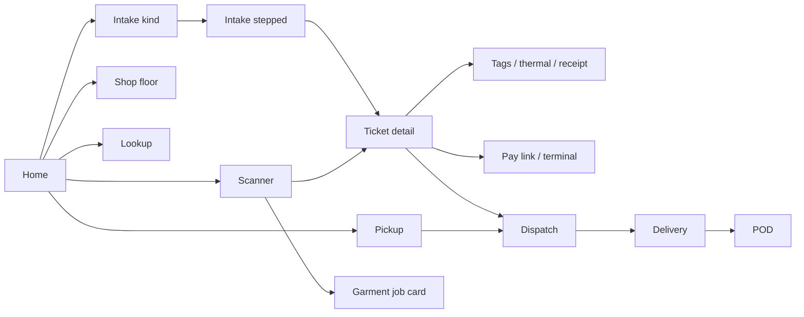

# Audit — alts.lstailors.com

**Date** 2026-08-01  
**Scope** FOH alterations app at `https://alts.lstailors.com` (`apps/alts`), plus the `app.lstailors.com` API surfaces it depends on.  
**Method** Live SPA/asset/CORS probes + static read of routes, pages, and related backend routes. No production writes. No staff login session available — auth-gated pages verified via source + unauthenticated API behavior.  
**Live build** Vercel HIT; HTML last-modified `2026-07-31 22:37 UTC`; bundle `/assets/index-Dh_z5Cd2.js`.

---

## Executive summary

The alts app is a mature FOH surface: home tiles, intake, shop floor, pickup, scanner, ticket detail, deliveries, invoices, customers, print, and e-ticket are all wired and SPA-routable. CORS to `app.lstailors.com` is correctly configured with credentials.

The highest-impact problems are **workflow correctness bugs**, not missing pages: broken garment QR links on ticket detail, garment lines that can render empty, parked-cart submit that drops intake fields, delivery POD that never closes the alteration ticket, NYC-hardcoded dispatch/defaults that punish HOU, and several “Send pay link” / quote SMS paths that do the wrong thing or nothing visible.

---

## 1. Page / route inventory

| Path | Users | Tier | Live SPA | Notes |
|---|---|---|---|---|
| `/` HomeTiles | FOH + driver | shell | 200 | Daily Espresso + tiles |
| `/login` | all | phone | 200 | Shared auth |
| `/intake/kind` | FOH | phone | 200 | Walk-in / on-order / redo |
| `/intake/alterations` | FOH | phone | 200 | Stepped intake |
| `/orders/alterations` | FOH | phone | 200 | Orders glass list |
| `/orders/alterations/:ticket` | FOH | shell | 200 | Ticket detail |
| `/orders/alterations/:ticket/photos` | FOH | phone | 200 | Photos |
| `/orders/alterations/:ticket/tags` | print | tablet | 200 | Garment tags |
| `/orders/alterations/:ticket/thermal` | print | tablet | 200 | Thermal ticket |
| `/orders/alterations/:ticket/receipt` | print | tablet | 200 | Receipt |
| `/shop-floor` | FOH | phone | 200 | Kanban board |
| `/pickup` | FOH | phone | 200 | Ready counter |
| `/parked` | FOH | phone | 200 | Parked carts |
| `/transfers` | FOH | tablet | 200 | Location / tailor transfer |
| `/dispatch` | FOH | tablet | 200 | Charge & dispatch |
| `/quote` | FOH | tablet | 200 | Quote SMS/email |
| `/lookup` | FOH + driver | phone | 200 | Find ticket |
| `/scanner` | FOH + driver | phone | 200 | QR |
| `/g/:ticket/:garmentId` | staff (intended) | phone | 200 | Job card — **no RoleGuard** |
| `/garments/:token` | redirect | phone | 200 | **Broken param shape** |
| `/board` | FOH | shell | 200 | Admin alterations board |
| `/customers` · `/:id` · `/new` | FOH | shell | 200 | `/new` is not a create form |
| `/invoices` · `/:id` | FOH | shell | 200 | |
| `/deliveries` · `/:id` · `/:id/pod` · `/:id/label` | FOH + driver | mixed | 200 | |
| `/e-ticket/:ticket` · `/t/:ticket` | public | phone | 200 | Customer ticket |
| `/pay/:invoiceId` | public | phone | 200 | Also print URLs point at app.lstailors.com |
| `*` | — | — | → `/` | Catch-all |

**Assets checked live:** manifests, SW register, favicon, apple-touch-icon, 192/512 icons — all 200. Dual manifests (`manifest-alts.json` + vite-plugin `manifest.webmanifest`) both present.

**API:** SPA talks to `https://app.lstailors.com`. CORS `Access-Control-Allow-Origin: https://alts.lstailors.com` + credentials OK. Staff endpoints return 401 unauthenticated as expected. Public e-ticket / pay-info endpoints exist without auth (see P1).

---

## 2. Workflow map (happy paths)



---

## 3. Findings (prioritized)

### P1 — Fix soon (broken or unsafe workflows)

#### P1-1 · Ticket-detail garment QR points at a dead route
- **Where** `TicketDetail.tsx:250` builds `/garments/{ticket}/{garment_id}`; `App.tsx:151` only registers `/garments/:token`; `GarmentTagRedirect.tsx:8-9` expects `ticketId` + `garmentId`.
- **Actual** Old/inline QR scans land on `/` (redirect). New thermal tags correctly use `/g/...` via `printUrls.ts`.
- **Impact** Staff scan QR from ticket detail → home instead of job card.
- **Fix** Route `/garments/:ticketId/:garmentId` (or generate `/g/...` everywhere) and align redirect params.

#### P1-2 · Ticket detail can hide alteration lines
- **Where** `TicketDetail.tsx:248` filters `l.garment_ref === garment.name`. Elsewhere (`AlterationReceipt`, `AltsETicket`, thermal, edit drawer, intake reopen) match `garment_id`.
- **Impact** “No alteration lines” on garments that have work — wrong totals, confusing FOH.
- **Fix** Match both: `garment_ref === garment.garment_id || garment_ref === garment.name` (thermal already does this).

#### P1-3 · Parked “Submit ticket” drops intake state
- **Where** Intake parks full `cart.intake` (`IntakeStepped.tsx:1203+`); commit path (`parked-carts.ts:117-135`) only sends simplified garments/lines + location/due/rush.
- **Impact** Direct submit from Parked tray can lose billing status, linked SO, sell items, notes, promise date/time, notify flag → wrong ticket/invoice.
- **Fix** Commit should hydrate `cart.intake` into the same create-ticket contract as normal intake, or force Resume-only.

#### P1-4 · Delivery POD does not close the alteration ticket
- **Where** `deliveries.ts` PATCH `/:id/pod` sets delivery Delivered only (`:960-1056`). TicketDetail hand-deliver does both delivery + `status: Picked Up` (`TicketDetail.tsx:967-968`).
- **Impact** Driver-delivered jobs stay Ready → still in Pickup/Home ready counts; can be released again at counter.
- **Fix** When `lsh_alteration_ticket` is set and delivery becomes Delivered, advance ticket to Picked Up (with unpaid-release SMS rules).

#### P1-5 · Public e-ticket is guessable-ID exposure
- **Where** `GET /api/intake-alterations/public/tickets/:name` (no auth); routes `/e-ticket/:ticketName`, `/t/:ticketName`.
- **Impact** Sequential ALT IDs expose customer name, status, totals, garments, line prices.
- **Fix** Signed unguessable tokens; keep public payload minimal.

#### P1-6 · Public pay-info mints Square links on GET
- **Where** `pay-info.ts` `resolvePaymentLink` (`:139-151`) creates Square payment links when none stored.
- **Impact** Guessable invoice IDs expose invoice/ticket details; unauthenticated GET can spam checkout rows.
- **Fix** Tokenize pay URLs; make GET side-effect-free; create links only from authenticated staff or verified token.

#### P1-7 · Workflow stepper allows multi-state jumps
- **Where** `TicketDetail.tsx:151` — any step clickable; backend can chain Received → … → Picked Up.
- **Impact** Accidental release of a just-received ticket; skips Ready notify path.
- **Fix** Only allow adjacent advance (or confirm on skip/release).

#### P1-8 · Intake draft restore drops HOU / rush / promise
- **Where** `intakeDraft.ts` payload has no `origin`, `promiseDate`, `promiseTime`, `isRush`. Restore falls back to NYC defaults (`IntakeStepped.tsx:254`).
- **Impact** After refresh, HOU tickets can resume as NYC; promised schedule/rush silently lost.
- **Fix** Persist and restore those fields; warn that photos must be reattached.

#### P1-9 · NYC default on every new ticket
- **Where** Frontend default `origin = "NYC"`; backend create also falls back to NYC; Dispatch hardcodes `location: "NYC"` (`Dispatch.tsx:180`); EditTicketDrawer presets `origin=NYC`.
- **Impact** HOU FOH creates NYC-priced / NYC-origin tickets and NYC delivery rows unless they catch the toggle.
- **Fix** Default from `/api/me` / active location; never hardcode NYC on dispatch create.

#### P1-10 · Dead in-app links
- **Where** `CustomerDetail.tsx:236` → `/custom-orders/:id`; `DeliveryDetail.tsx:166` → `/sales-orders/:orderRef`. Neither route exists in alts (catch-all → home).
- **Impact** Staff click → bounce home.
- **Fix** Link to `https://app.lstailors.com/...` or remove the link; for alterations use ticket routes.

#### P1-11 · Quote SMS failure sends “ready” notify
- **Where** `QuoteComposer.tsx:78-82` falls back to `/notify-ready` on quote SMS error.
- **Impact** Customer gets “your order is ready” while still quoting.
- **Fix** Remove fallback; fail loudly until quote template exists.

#### P1-12 · Scanner / payment mutations are auth-only, not role-scoped
- **Where** Scanner mark-paid / mark-delivered / advance; payments card-on-file. App allows `driver` on `/scanner`.
- **Impact** Any logged-in role that can hit the API can mutate payment/status with ERP/Square credentials.
- **Fix** Role gates per action; drivers only delivery-scoped actions.

---

### P2 — Workflow friction / accuracy

| ID | Issue | Where | Impact / fix |
|---|---|---|---|
| P2-1 | “Send pay link” only creates link + toast — no SMS, no visible URL | `PickupCounter.tsx:128-141`, `Dispatch.tsx:197` | Rename or copy/SMS the URL |
| P2-2 | Scanner auto-navigates; action sheet rarely used | `AltsScanner.tsx` + `scanRoutes.ts` | Show sheet first for actionable types |
| P2-3 | Home “Out to tailors” uses `origin !== nyc` + assigned tailor | `HomeTiles.tsx:237-239` | Use transfer/home flag, not origin |
| P2-4 | Due-today / delivered-today use UTC date | Home, Orders, ShopFloor | Use America/New_York or America/Chicago |
| P2-5 | Lists/stats capped at `limit=200` | Home, Orders, ShopFloor | Aggregates or paginate |
| P2-6 | Duplicate deliveries creatable for same ticket | TicketDetail + Dispatch + backend | Upsert / reject if active join exists |
| P2-7 | Line photos attach to wrong line | Intake upload + backend append-to-last | Persist client line key |
| P2-8 | Non-billable intake can submit garments with zero work | `IntakeStepped.tsx` validation | Require lines unless explicit intake-only |
| P2-9 | Edit ticket `/full` strips line metadata / may desync invoice | `EditTicketDrawer` + alterations PATCH | Preserve metadata; reconcile SI |
| P2-10 | Print Receipt on paid ticket prints ticket receipt, not SI payment receipt | `TicketDetail` + print route | Pass `sales_invoice` when paid |
| P2-11 | Due-date edit does not update promised date | TicketDetail due-date PATCH | Align or separate editors |
| P2-12 | Dispatch address defaults New York/NY; not prefilled from customer | Dispatch + `/from-order` | Prefill from customer; origin-aware city/state |
| P2-13 | Dual pay surfaces (alts `/pay` vs print `app.lstailors.com/pay`) | `printUrls.ts` | Pick one canonical pay origin |
| P2-14 | Dual PWA manifests in HTML | index.html | Keep one source of truth |
| P2-15 | `/g` unguarded in React; API 401 → confusing empty/error page | `App.tsx:150` | RoleGuard or login-friendly empty state |
| P2-16 | Print routes have no RoleGuard (tablet only) | `App.tsx:163-175` | Rely on API auth; add guard if pages leak data before 401 |

---

### P3 — Polish / leftover

| ID | Issue | Where |
|---|---|---|
| P3-1 | Transfers always shows tailor picker: `(dest === "Home" \|\| true)` | `Transfers.tsx:150` |
| P3-2 | `/customers/new` + “New Client” button → “create from intake” dead-end | `CustomerDetail.tsx:794`, `Customers.tsx` |
| P3-3 | Orders “Released unpaid” includes Ready unpaid | `OrdersGlass.tsx:52-59` |
| P3-4 | ShopFloor Pickup action navigates `/pickup` without ticket query | `ShopFloorBoard.tsx` |
| P3-5 | Phone Pickup / Home link into tablet-only Dispatch mid-flow | Pickup + HomeTiles + `TabletOnly` |
| P3-6 | Home header hardcodes East 61st / NYC | `HomeTiles.tsx:93-97`, `:511` |
| P3-7 | Delivery label hardcodes NYC address | `DeliveryLabelPrint.tsx` |
| P3-8 | tsconfig still aliases `@/*` → webapp while Vite removed it | `tsconfig.app.json` vs `vite.config.ts` |
| P3-9 | Shared `queries.ts` still carries admin/YZ/Sofia hooks unused by alts routes | bloat / confusion |

---

## 4. What looks healthy

- SPA hosting + deep-link fallbacks return 200 for all primary paths.
- CORS + credentials between alts and app backend are correct.
- Staff APIs reject unauthenticated calls (401) for tickets, board, print, garment (with valid body).
- PWA icons and both manifests resolve.
- Print tag generation uses canonical `/g/:ticket/:garmentId`.
- Intake has draft + park patterns; many payment/print/SMS paths are intentionally wired.
- RoleGuard coverage is broadly present on FOH surfaces (exceptions noted above).

---

## 5. Suggested fix order

1. **Quick wins (same PR possible):** P1-1 QR route, P1-2 line matching, P1-10 dead links, P1-11 quote fallback, P3-1 transfers `|| true`, P2-1 pay-link UX copy.
2. **Data integrity:** P1-3 parked commit, P1-4 POD→ticket close, P1-7 stepper, P2-6 duplicate deliveries.
3. **Location correctness:** P1-8 draft fields, P1-9 NYC defaults, P2-3/P2-12 HOU.
4. **Security:** P1-5 e-ticket tokens, P1-6 pay-info side effects, P1-12 role gates.

---

## 6. Out of scope / next audit slices

- Authenticated click-through of every FOH path on a shop iPad (needs staff session).
- Hardware (Epson thermal, Square Terminal, camera scanner) — see `docs/audits/HER-55-hardware-e2e.md`.
- `app.lstailors.com` admin / House / Sofia / YZ surfaces.
- ERPNext DocType / workflow fixtures in `frappe/ls_alterations` (covered historically in `ALTERATIONS_AUDIT.md`).

---

## 7. Evidence appendix (live probes)

```
GET https://alts.lstailors.com/                     → 200 (SPA shell)
GET …/login|/intake|/pickup|/scanner|/board/…      → 200 (SPA)
GET …/manifest-alts.json · manifest.webmanifest     → 200
GET …/icon-192.png · icon-512.png                   → 200
OPTIONS https://app.lstailors.com/api/me
  Origin: https://alts.lstailors.com                → 204 + ACAO alts + credentials
GET  https://app.lstailors.com/api/me               → 401
POST /api/garment/job-card {ticket,garment_id}      → 401
GET  /api/intake-alterations/public/tickets/:name  → 404 (public, no auth)
GET  /api/pay-info/:id                              → 404 (public, no auth)
```
